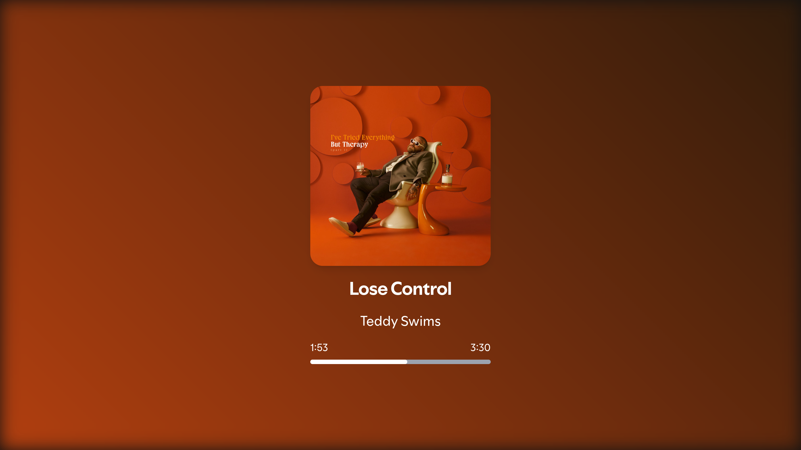
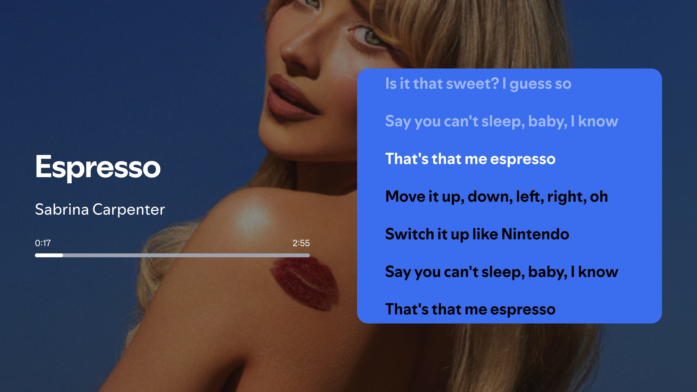
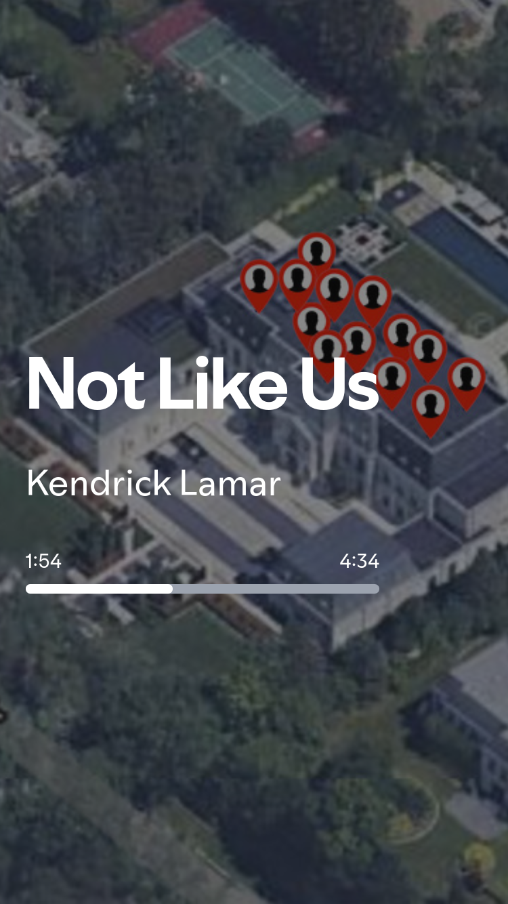

# Spotify Now Playing

A simple Spotify currently playing song viewer with lyrics.

- [Spotify Now Playing](#spotify-now-playing)
  - [Features](#features)
  - [Screenshots](#screenshots)
  - [Installation](#installation)
  - [Contributors](#contributors)
  - [License](#license)

## Features

- View the currently playing song on Spotify.
- View the lyrics of the currently playing song.
- Toggle between two alternative themes.
- Responsive design.
- i18n support for 11 languages.

## Screenshots







## Installation

1. Create a Spotify Developer account and create a new application.
2. Add `http://localhost:5173/callback` to the Redirect URIs in the Spotify Developer Dashboard.
3. Find your SP_DC cookie from Spotify Web Player. (See [Finding sp_dc](https://github.com/akashrchandran/syrics/wiki/Finding-sp_dc))
4. Clone the repository.
5. Run `npm install` to install the dependencies.
6. Create a `.env` file in the root directory and add the following:

```
VITE_SPOTIFY_CLIENT_ID=your-spotify-client-id
VITE_SPOTIFY_REDIRECT_URI=http://localhost:5173/callback
VITE_SPOTIFY_SP_DC=your-spotify-sp-dc
```

7. Run `npm run dev` to start the development server.
8. Open `http://localhost:5173` in your browser.

## Contributors

- [Natan Chiodi](https://github.com/Natoune) - Creator

If you want to contribute, please see the [CONTRIBUTING.md](CONTRIBUTING.md) file.

## License

This project is licensed under the MIT License - see the [LICENSE.md](LICENSE.md) file for details.
